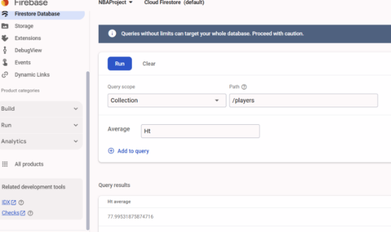
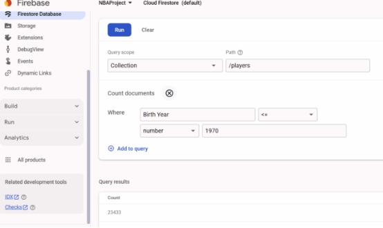
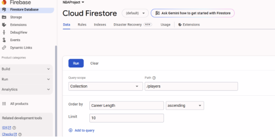
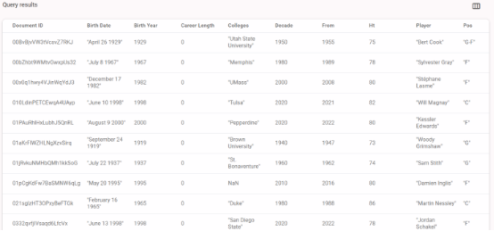
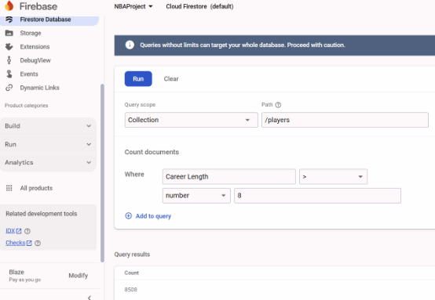

                                         ***Project Details***

***NBA Player Analytics Project***                                                                     

***Karagiannis Dimitrios***

***E-mail: [karagiannis.d3@live.unic.ac.cy***](mailto:karagiannis.d3@live.unic.ac.cy)***

***Project Motivation & Goals***

***Motivation***

*Basketball has always been a passion of mine, not just as a fan but also as a player. Playing the sport has given me a deeper appreciation for the skills, strategies, and physical attributes that define great players. With basketball's rich history and constant evolution, there is a wealth of data that can uncover fascinating insights about players, teams, and trends over time. By combining my experience as a player with the tools and techniques of data science, I aim to explore and share valuable insights that will appeal to basketball enthusiasts and data aficionados alike.*

***Goals***

*The goal of this project is to analyze historical NBA player data to uncover interesting trends and insights. This involves**:***

- *Understanding player attributes such as height, weight, and career longevity.*
- *Analyzing trends across decades, positions, and colleges.*
- *Identifying top players by height, weight, career length, and birth year distribution.*
- *Visualizing key patterns to communicate insights effectively.*
- *Integrating Big Data solutions (Google BigQuery and Firestore) for storage, querying, and analysis**.***
-----
***Dataset Details and Preprocessing Steps***

***Dataset***

*The dataset used in this project is **player\_data.csv** and it is sourced from **Kaggle** and contains detailed information about NBA players, including**:***

- *Player names*
- *Positions*
- *Height and weight*
- *Career start and end years*
- *Colleges attended*
- *Birth dates*

***Preprocessing Steps***

1. ***Data Cleaning:***
   1. *Converted height from feet-inches to total inches for uniformity.*
   1. *Converted weight to numeric values, handling errors and missing data.*
   1. *Dropped rows with invalid or missing data for critical columns (From, To, Ht, Wt).*
1. ***Feature Engineering:***
   1. *Added a Career Length column to measure the duration of each player's NBA career.*
   1. *Created a Decade column to group players based on their career start years.*
   1. *Extracted Birth Year from the Birth Date column.*
1. ***Grouping and Analysis:***
   1. *Calculated average height and weight by position and decade.*
   1. *Identified top players by height, weight, and career length.*
1. ***Integration:***
   1. *Data was uploaded to Firestore and analyzed using BigQuery for scalability.*

***Solution Overview:***

*To analyze the historical NBA player data effectively, this project leverages key concepts and tools from data science and big data, including:*

1. ***Data Cleaning and Preprocessing:***
   1. *Ensuring the dataset is clean, consistent, and ready for analysis by handling missing data, converting formats, and engineering new features (e.g., Career Length, Decade).*
   1. ***Using pandas for efficient data manipulation and transformation.***
1. ***Exploratory Data Analysis (EDA):***
   1. *Utilizing visualizations and statistical summaries to uncover patterns and insights in player attributes, such as height, weight, career longevity, and trends across decades.*
1. ***Big Data Integration:***
   1. *Employing Firestore as a NoSQL database for efficient data storage and querying.*
   1. *Using BigQuery to demonstrate scalability and handle larger datasets, enabling queries across multiple dimensions, such as positions and colleges.*
1. ***Visualization Techniques:***
   1. *Leveraging Matplotlib to create visualizations that highlight player trends, distributions, and historical patterns.*
   1. *Providing graphical insights into player data to make results accessible and interpretable**.***
1. ***Big Data Dimensions:***
   1. *Analyzing the dataset through the lens of big data dimensions (e.g., Volume, Variety, Veracity) to understand its scope and challenges.*

*By combining these techniques, this project provides a comprehensive exploration of NBA player data, making use of both fundamental data science concepts and modern big data tools to draw meaningful insights.*

***Tools and Libraries Used***

***Programming Language***

- *Python 3.10+*

***Libraries***

- ***Pandas:** For data cleaning, transformation, and analysis.*
- ***Matplotlib:** For visualizing trends and distributions**.***
- ***Firebase Admin SDK:** For Firestore integration**.***
- ***Google BigQuery:** For querying large datasets**.***
- ***Google Colab:** As the primary development environment**.***

***Big Data Tools***

- ***Google BigQuery:** To store and query large datasets**.***
- ***Firebase Firestore:** As a NoSQL database for data storage**.***

***How to Run the Code***

***Prerequisites***

1. **Install the required Python libraries*:***

1. ***Obtain the following files:***
   1. ***player\_data.csv:** The main dataset**.***
   1. ***Service account JSON file for Firebase Admin SDK.***

***Steps to Run***

1. ***Upload Files:***
   1. *Open the script in Google Colab or your local Python environment.*
   1. *Upload the dataset (**player\_data.csv**) and the Firebase service account **JSON file.***
1. ***Run the Script:***
   1. *Execute the cells in order to:*
      1. *Preprocess the data.*
      1. *Perform exploratory data analysis.*
      1. *Visualize trends.*
      1. *Integrate and query data using Firestore and BigQuery.*
1. ***BigQuery Integration:***
   1. *Ensure your Google Cloud project is set up.*
   1. *Configure BigQuery credentials and tables as per the project requirements**.***
1. ***Firestore Integration:***
   1. *Upload the dataset to Firestore using the provided Firebase credentials.*
   1. *Query the database for player data**.***

***Output***

- *Cleaned and analyzed data is displayed in tabular and graphical formats.*
- *Results are stored and queried in Firestore and BigQuery**.***

***Big Data Dimensions***

***1. Volume:***

- *The dataset **players\_data.csv** contains a substantial number of records detailing NBA players, including their physical attributes, career timelines, positions, and colleges*.
- *While the dataset in its current form may not be extremely large, integrating additional sources (e.g., performance statistics, advanced analytics, or historical game data) can significantly increase the data volume.*
- *Historical data spanning decades also contributes to the dataset's volume, as it grows with each passing season.*

***2. Velocity:***

- *In its current form, the dataset represents static data. However, if extended to include real-time updates (e.g., live game stats, player transfers, or injury reports), the velocity dimension becomes relevant.*
- *Using Firebase or another NoSQL database allows for handling streaming data, such as live updates on player performance during games or career progress over time.*

***3. Variety:***

- *The dataset contains diverse types of data:*
  - ***Numerical:** Height, weight, career length, and years active.*
  - ***Categorical:** Position, colleges, and player names.*
  - ***Temporal:** Birth year, active years, and career span.*
- *Additional integrations (e.g., social media sentiment analysis, game statistics, or team dynamics) could increase variety, requiring flexible processing tools.*

***4. Veracity:***

- *The dataset might include missing, inconsistent, or erroneous data (e.g., invalid heights or weights, players without birth years). Cleaning and validating the data ensure accurate analyses.*
- *Historical inaccuracies or biases in data recording can also affect the trustworthiness of insights.*

***5. Value:***

- *The dataset offers significant value to sports analysts, teams, and fans by providing insights into player trends, physical attributes, and career trajectories.*
- *It can help answer important questions, such as the evolution of player attributes over decades or identifying colleges that consistently produce top players.*

***6. Variability:***

- *Data trends and patterns may vary depending on the era or context (e.g., shifts in player positions or styles of play over decades).*
- *Analysis must account for such temporal variability to ensure meaningful insights.*

***Queries:***

- *“The following query was executed in Firestore Query Builder to filter the average height (in inches) of the dataset:"*

- *“The following query was executed in Firestore Query Builder to count the players that were born before 1970: “*

- *“The following query was executed in Firestore Query Builder to put the players in ascending order: “*

- *“The following query was executed in Firestore Query Builder count the players with career length longer than 8 years: “*

***Conclusion***

*The **NBA Player Analytics Project** successfully explored historical player data to uncover fascinating trends and insights within the world of basketball. By leveraging tools such as **Python** and **Firestore**, the project analyzed various aspects of player attributes, career longevity, and historical trends, providing a comprehensive overview of how the sport has evolved over time.*

*Although I encountered challenges with integrating **BigQuery**, I managed to utilize **Firestore** effectively for querying and analyzing the dataset. These tools allowed for efficient storage, exploration, and visualization of data, showcasing how modern cloud-based technologies can streamline data analysis processes.*

*The project revealed key patterns, such as average height and weight trends across decades, positions producing the longest careers, and colleges consistently developing NBA talent. As a basketball player, this project not only allowed me to combine my passion for the sport with data science but also deepened my understanding of the historical dynamics and attributes of the game’s players.*

*Future extensions could involve resolving the BigQuery integration challenges, incorporating live game statistics, advanced performance analytics, or even sentiment analysis from social media to broaden the scope and application of this project. By continually building on this foundation, we can further uncover actionable insights that contribute to the evolving world of basketball analytics.*

